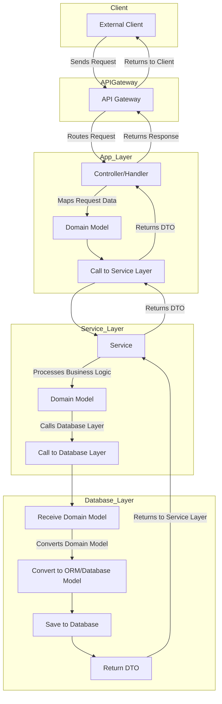

In modern software development, organizing code into distinct layers helps maintain a clean and modular architecture. This blog post will walk you through the concept of a layered architecture using a practical example: creating a user in a web application. We’ll break down the different layers and explain their responsibilities.

## Architecture Overview

The architecture is divided into three main layers:

- **App Layer**: Handles incoming requests and maps them to domain models.
- **Service Layer**: Contains business logic and interacts with the database layer.
- **Database Layer**: Manages database operations and converts domain models to database models.

Additionally, we have a **Models** section that includes:

- **Domain Models**: Represent the core business entities in your application.
- **DTOs (Data Transfer Objects)**: Simplified data representations for communication between layers.

Here's a visual representation of the layered architecture:

## Example Flow for User Creation

Let's apply this architecture to a specific use case: creating a user. Here’s how the process unfolds across the different layers.

### 1. API Endpoint Receives User Information

A client (like a web or mobile app) sends a request to your API with the necessary user information—such as username, email, and password.

### 2. Controller/Handler in the App Layer

The request is handled by a controller or handler within the app layer. This component performs the following tasks:

- **Validation**: Ensures that the incoming data is correct (e.g., the email format is valid).
- **Mapping**: Converts the validated data into a domain model or intermediary form suitable for processing in the service layer.

### 3. Service Layer

The controller passes the domain model to the service layer, which handles the core business logic:

- **Gathering Data**: The service layer may need to call other services to fetch additional user-related data, like a profile template or default permissions.
- **Business Logic**: This is where operations like password hashing or checking for existing users occur.
- **Final Domain Model**: Once all operations are complete, the service layer constructs the final domain model that represents the user.

### 4. Database Layer

Next, the service layer passes the domain model to the database layer, which is responsible for:

- **Model Conversion**: Converting the domain model into a format that the database understands (e.g., an ORM-specific model).
- **Database Operation**: Saving the model into the database.
- **Return DTO**: After saving, the database layer returns a DTO or confirmation of the operation.

### 5. Response

Finally, the service layer sends the DTO back to the app layer, which prepares the response. The app layer then returns this response to the client, completing the user creation process.

## Conclusion

This layered architecture ensures that your application remains modular, scalable, and easy to maintain. By isolating the business logic in the service layer, you keep your codebase clean and organized, making it easier to extend and manage as your application grows. This structure not only supports the creation of a user but can be applied to a wide range of operations within your application.

---

## References

- [Design Considerations and Internals - REAN Foundation](https://github.com/REAN-Foundation/reancare-service/blob/develop/docs/design-considerations.md#internals)
