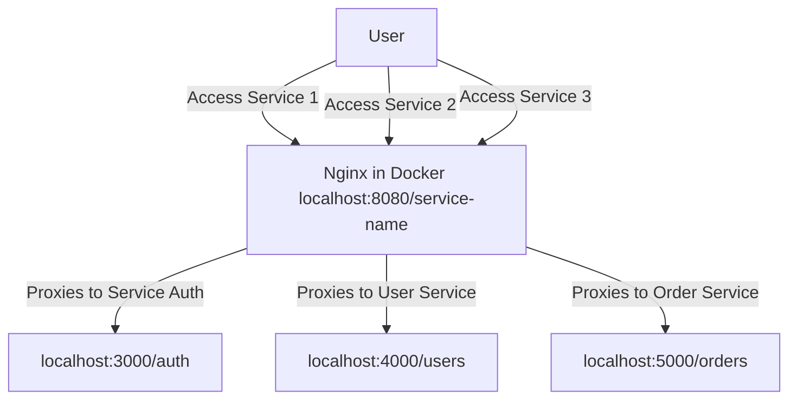

In a microservice architecture, you often have multiple services running on different ports. Accessing them often becomes cumbersome. With Nginx and Docker, you can proxy these services under one unified port and URL structure, making development easier to manage.

This guide will show you how to set up **Nginx with Docker** to route multiple services through a single port—perfect for local microservice development without installing Nginx directly on your machine.

### **Agenda**

- How to proxy multiple services under a single Nginx instance.
- How to containerize this setup using Docker for portability.
- How to avoid local installation of Nginx and keep your environment clean.

### **Prerequisite**

- **Docker** installed on your local machine. You can download it from [Docker’s official website](https://www.docker.com/get-started).
- Multiple services running locally on different ports (e.g., `localhost:3000`, `localhost:4000`).

### **Step-by-Step Guide**

#### 1. **Create a Project Directory**

Start by creating a directory for your project where you’ll store your Nginx configuration and Docker files.

```bash
mkdir nginx-docker-microservices
cd nginx-docker-microservices
```

#### 2. **Create a Custom Nginx Configuration File**

Inside your project directory, create a file named `nginx.conf`. This configuration will define how Nginx proxies different microservices under a single port.

Here's an example `nginx.conf` that proxies multiple services:

```nginx
events {
    worker_connections 1024;
}

http {
    server {
        listen 80;

        server_name localhost;

        # Service 1: Forward requests from /service1 to localhost:3000
        location /service1 {
            proxy_pass <http://host.docker.internal:3000>;
            proxy_set_header Host $host;
            proxy_set_header X-Real-IP $remote_addr;
            proxy_set_header X-Forwarded-For $proxy_add_x_forwarded_for;
            proxy_set_header X-Forwarded-Proto $scheme;
        }

        # Service 2: Forward requests from /service2 to localhost:4000
        location /service2 {
            proxy_pass <http://host.docker.internal:4000>;
            proxy_set_header Host $host;
            proxy_set_header X-Real-IP $remote_addr;
            proxy_set_header X-Forwarded-For $proxy_add_x_forwarded_for;
            proxy_set_header X-Forwarded-Proto $scheme;
        }

        # Service 3: Forward requests from /service3 to localhost:5000
        location /service3 {
            proxy_pass <http://host.docker.internal:5000>;
            proxy_set_header Host $host;
            proxy_set_header X-Real-IP $remote_addr;
            proxy_set_header X-Forwarded-For $proxy_add_x_forwarded_for;
            proxy_set_header X-Forwarded-Proto $scheme;
        }
    }
}
```

- **`listen 80;`**: This instructs Nginx to listen on port 80 (the default HTTP port).
- **Location blocks**: Each `location` block defines a path that maps to a different service running locally on a different port.
    - Requests to `/service1` are forwarded to `localhost:3000`.
    - Requests to `/service2` are forwarded to `localhost:4000`.
    - Requests to `/service3` are forwarded to `localhost:5000`.
- **`proxy_pass`**: This directs the traffic to the respective service using `host.docker.internal` to refer to the host machine from within the Docker container.

To help you better understand how Nginx routes requests in this setup, here's a diagram that visualizes how the proxying works.



- The **user** accesses the services through `http://localhost:8080/service1`, `/service2`, and `/service3`.
- **Nginx**, running inside Docker, listens on port 8080 and forwards these requests to the respective services based on the paths.
- Each **service** runs locally on a separate port (`3000`, `4000`, `5000`), but the user interacts with them under a single Nginx-managed port (`8080`).

#### 3. **Create a Dockerfile**

Now, create a `Dockerfile` to build an Nginx container with the custom configuration.

Create a file named `Dockerfile` in the same project directory and add the following content:

```
# Use the official Nginx image from Docker Hub
FROM nginx:latest

# Copy your custom nginx.conf to the container
COPY nginx.conf /etc/nginx/nginx.conf
```

This Dockerfile:

- Pulls the official Nginx image.
- Copies your custom `nginx.conf` into the appropriate directory inside the container.

#### 4. **Build the Docker Image**

With the `nginx.conf` and `Dockerfile` ready, you can now build the Docker image.

Run this command to build the image:

```bash
docker build -t custom-nginx-microservices .
```

This will create a Docker image tagged as `custom-nginx-microservices`.

#### 5. **Run the Nginx Container**

Once the image is built, you can run the container. Use the `-p` flag to map port 8080 on your local machine to port 80 inside the Nginx container.

```bash
docker run -d -p 8080:80 custom-nginx-microservices
```

This command runs the container in the background (`-d`) and maps **port 8080** on your host machine to **port 80** in the Docker container.

#### 6. **Access Your Services**

Now, all your services are available under a single URL structure:

- **Service 1**: Accessible at `http://localhost:8080/service1`
- **Service 2**: Accessible at `http://localhost:8080/service2`
- **Service 3**: Accessible at `http://localhost:8080/service3`

For example:

- A request to `http://localhost:8080/service1` will be proxied to `localhost:3000`.
- A request to `http://localhost:8080/service2` will be proxied to `localhost:4000`.
- A request to `http://localhost:8080/service3` will be proxied to `localhost:5000`.

#### 7. **Add More Services (Optional)**

You can easily add more services by editing your `nginx.conf` and adding more `location` blocks. For example:

```nginx
# Service 4: Forward requests from /service4 to localhost:6000
location /service4 {
    proxy_pass <http://host.docker.internal:6000>;
    proxy_set_header Host $host;
    proxy_set_header X-Real-IP $remote_addr;
    proxy_set_header X-Forwarded-For $proxy_add_x_forwarded_for;
    proxy_set_header X-Forwarded-Proto $scheme;
}
```

Then rebuild the Docker image and restart the container:

```bash
docker build -t custom-nginx-microservices .
docker stop <container_id>
docker run -d -p 8080:80 custom-nginx-microservices
```

#### 8. **Stopping and Cleaning Up**

To stop the running Nginx container, use the following command:

```bash
docker stop <container_id>
```

You can find the container ID using:

```bash
docker ps
```

To remove the container:

```bash
docker rm <container_id>
```

---

### **Makefile for Easy Docker Commands**

To make managing the Docker container easier, here's a **Makefile** that simplifies the commands.

Create a file named `Makefile` in your project directory with the following content:

```makefile
# Variables
DOCKER_IMAGE_NAME=custom-nginx-microservices
DOCKER_CONTAINER_NAME=nginx-microservices
HOST_PORT=8080
CONTAINER_PORT=80

# Build the Docker image
build:
	@echo "Building the Docker image..."
	docker build -t $(DOCKER_IMAGE_NAME) .

# Run the Docker container
run: build
	@echo "Running the Docker container..."
	docker run -d -p $(HOST_PORT):$(CONTAINER_PORT) --name $(DOCKER_CONTAINER_NAME) $(DOCKER_IMAGE_NAME)

# Stop the Docker container
stop:
	@echo "Stopping the Docker container..."
	docker stop $(DOCKER_CONTAINER_NAME)

# Remove the Docker container
remove: stop
	@echo "Removing the Docker container..."
	docker rm $(DOCKER_CONTAINER_NAME)

# Clean up the Docker container and image
clean: remove
	@echo "Removing the Docker image..."
	docker rmi $(DOCKER_IMAGE_NAME)

# Rebuild and restart the container
restart: clean run
	@echo "Rebuilding and restarting the container..."

```

### **Using the Makefile**

You can now manage your Nginx Docker container with simple commands:

- **Run the container**: `make run`
- **Stop the container**: `make stop`
- **Remove the container**: `make remove`
- **Clean everything**: `make clean`
- **Restart the container**: `make restart`

---

## **Conclusion**

By containerizing Nginx with Docker, you gain flexibility and avoid local installation headaches. You can now proxy multiple microservices under a single port, and the use of a Makefile simplifies managing your Docker containers. This setup will streamline your local development, especially when working with a microservices architecture!