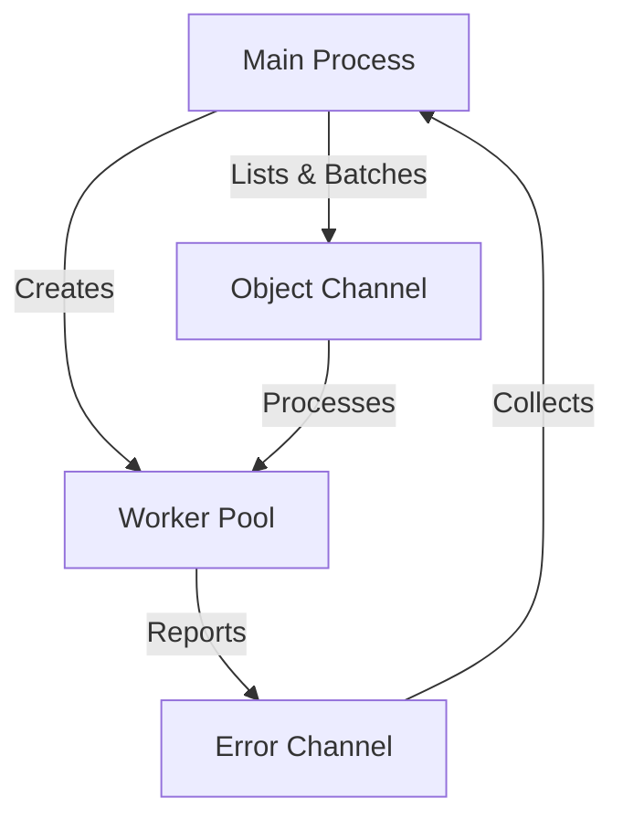

Managing large-scale deletions in Amazon S3 can be challenging, especially when dealing with folders containing thousands of objects. While AWS provides APIs for these operations, building an efficient solution requires careful consideration of concurrency, rate limits, and error handling.

## The Problem

When working with S3, several challenges emerge when deleting folders:

- S3 doesn't provide a native "delete folder" operation
- Sequential deletion of thousands of objects is prohibitively slow
- AWS limits DeleteObjects API calls to 1000 objects per request
- Rate limiting can cause throttling if not handled properly

## Solution Overview

Solution discussed here implements a concurrent processing pattern that efficiently handles large-scale deletions while respecting AWS limitations:



### Key Components

1. **Worker Pool**: Multiple goroutines process deletions in parallel
2. **Batch Processing**: Respects AWS's 1000 objects per request limit
3. **Channel Communication**: Coordinates workers and error handling
4. **Context Support**: Enables graceful cancellation

## Implementation

```go
func listAndDeleteObjects(ctx context.Context, svc *s3.S3, bucketName, folderName string) error {
  if folderName == "" {
    // if folder name is not provided, entire bucket will be deleted
    return fmt.Errorf("folder name is required")
  }

  const (
    S3_FOLDER_DELETE_WORKER_COUNT = 5    // Adjustable based on needs
    S3_MAX_BATCH_DELETE_LIMIT     = 1000 // AWS DeleteObjects limit
  )

  // Create channels for object batches and errors
  objChan := make(chan []*s3.ObjectIdentifier, S3_FOLDER_DELETE_WORKER_COUNT)
  errorChan := make(chan error, S3_FOLDER_DELETE_WORKER_COUNT)
  var wg sync.WaitGroup

  // Start delete workers
  for i := 0; i < S3_FOLDER_DELETE_WORKER_COUNT; i++ {
    wg.Add(1)
    go deleteWorker(ctx, svc, bucketName, objChan, errorChan, &wg)
  }

  // List and send objects for deletion
  go func() {
    defer close(objChan)
    if err := listObjects(ctx, svc, bucketName, folderName, objChan, S3_MAX_BATCH_DELETE_LIMIT); err != nil {
      errorChan <- err
    }
  }()

  // Wait for workers and close error channel
  go func() {
    wg.Wait()
    close(errorChan)
  }()

  // Handle any errors
  for err := range errorChan {
    if err != nil {
      return err // Return first error encountered
    }
  }

  return nil
}

func deleteWorker(
  ctx context.Context,
  svc *s3.S3,
  bucket string,
  objChan <-chan []*s3.ObjectIdentifier,
  errorChan chan<- error,
  wg *sync.WaitGroup,
) {
  defer wg.Done()

  for objects := range objChan {
    select {
    case <-ctx.Done():
      return
    default:
      if err := deleteObjectBatch(ctx, svc, bucket, objects); err != nil {
        errorChan <- err
        return
      }
    }
  }
}

func deleteObjectBatch(
  ctx context.Context,
  svc *s3.S3,
  bucket string,
  objects []*s3.ObjectIdentifier,
) error {
  _, err := svc.DeleteObjectsWithContext(ctx, &s3.DeleteObjectsInput{
    Bucket: aws.String(bucket),
    Delete: &s3.Delete{
      Objects: objects,
      Quiet:   aws.Bool(true),
    },
  })

  return err
}

func listObjects(
  ctx context.Context,
  svc *s3.S3,
  bucket, prefix string,
  objChan chan<- []*s3.ObjectIdentifier,
  batchSize int,
) error {

  batch := make([]*s3.ObjectIdentifier, 0, batchSize)
  input := &s3.ListObjectsV2Input{
    Bucket: aws.String(bucket),
    Prefix: aws.String(prefix),
  }

  for {
    select {
    case <-ctx.Done():
      return ctx.Err()
    default:
      output, err := svc.ListObjectsV2WithContext(ctx, input)
      if err != nil {
        return err
      }

      // Add objects to batch
      for _, obj := range output.Contents {
        batch = append(batch, &s3.ObjectIdentifier{Key: obj.Key})

        // Send batch if it reaches max size
        if len(batch) >= batchSize {
          objChan <- batch
          batch = make([]*s3.ObjectIdentifier, 0, batchSize)
        }
      }

      // Break if no more objects
      if !aws.BoolValue(output.IsTruncated) {
        // Send remaining batch
        if len(batch) > 0 {
          objChan <- batch
        }
        return nil
      }
      input.ContinuationToken = output.NextContinuationToken
    }
  }
}
```

### Usage Example

```go
import (
	"context"
	"log"

	"github.com/aws/aws-sdk-go/aws"
	"github.com/aws/aws-sdk-go/aws/session"
	"github.com/aws/aws-sdk-go/service/s3"
)

func main() {
    sess := session.Must(session.NewSession(&aws.Config{
        // configure your aws session here
    }))
    svc := s3.New(sess)
    
    ctx := context.Background()
    err := listAndDeleteObjects(ctx, svc, "my-bucket", "folder/path/to/delete")
    if err != nil {
        log.Fatal(err)
    }
}
```

## Implementation Considerations

### 1. Rate Limiting
- Worker count helps control API request rate
- Adjustable based on your AWS account limits

### 2. Memory Management
- Batches are processed independently
- Memory usage stays consistent regardless of folder size
- Efficient garbage collection of processed batches

### 3. Error Handling
- Context cancellation for graceful shutdown
- Error propagation through channels

## Potential Improvements

1. **Retry Mechanism**
   ```go
   // Add exponential backoff for failed deletions
   if err := retry.Do(func() error {
       return deleteObjectBatch(ctx, svc, bucket, objects)
   }); err != nil {
       return err
   }
   ```

2. **Progress Tracking**
   ```go
   // Add progress channel for monitoring
   progress := make(chan int64)
   go func() {
       var total int64
       for count := range progress {
           total += count
           log.Printf("Deleted %d objects", total)
       }
   }()
   ```

3. **Metrics Collection**
   - Track deletion rates
   - Monitor AWS throttling
   - Measure batch processing times

## Conclusion

This post discusses an efficient and reliable solution for deleting large S3 folders while respecting AWS limits, utilizing concurrency, and handling errors effectively - making it ideal for cleanup operations, lifecycle management, and cost optimization tasks.

## References

- [AWS S3 DeleteObjects API](https://docs.aws.amazon.com/AmazonS3/latest/API/API_DeleteObjects.html)
- [S3 Go SDK Documentation](https://pkg.go.dev/github.com/aws/aws-sdk-go@v1.55.5/service/s3#S3.DeleteObjects)
